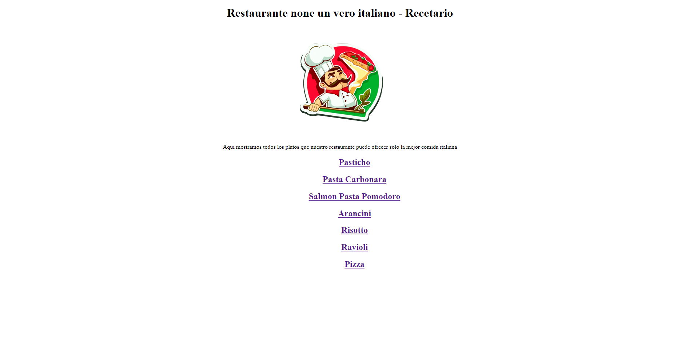

# proweb_gabrielle
Proyecto de pagina web para la materia programacion Web

# Nombre del Proyecto

> Declaración de un párrafo sobre el proyecto.

Descripción adicional sobre el proyecto y sus características.

## Construido con

- Lenguajes principales
- FrameWorks
- Tecnologías utilizadas

## Live Demo o deploy del proyecto en algun hosting

[Live Demo Link](https://livedemo.com)

Para poner en funcionamiento el proyecto, siga estos sencillos pasos de ejemplo.

### Requisitos previos

### Configuración

### Instalar

### Uso

### Ejecutar pruebas

### Implementación

## Autor

👤 **Gabrielle Jesus Brizuela Guacache**

- GitHub: [@aristides1000](https://github.com/GabrielleMrRobot)

## Espero que le haya gustado

¡Dale un ⭐️ si te gusta este proyecto!
